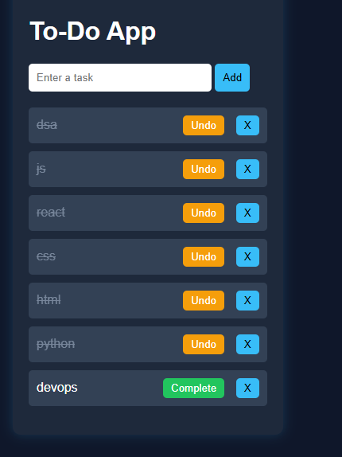

# 📝 To-Do App

A modern To-Do application built using HTML, CSS, and JavaScript with task persistence using local storage.

---

## 🚀 Features
- ➕ Add tasks
- ✅ Mark tasks as complete / undo
- ❌ Delete tasks
- 💾 Saves tasks using local storage
- 🎨 Clean and responsive UI

---

## 🛠️ Technologies Used
- HTML
- CSS
- JavaScript

---

## 📸 Preview

---

## 🔗 Live Demo
https://archanareddy3640.github.io/todo-app/
